<!-- _class: homePage -->
<!-- _header: "" -->
<!-- _footer: "" -->
<!-- _paginate: "" -->

# 普通人如何用好 AI Agent

## 5.24 得到同学节分享

**分享人：@天街小雨润如苏同学　｜　2026 年 5 月**

<div class="footnote">
  * 内容由 AI 生成，源码托管在 <a href="https://github.com/syjsu/ai-tech-sharing-ppt">https://github.com/syjsu/ai-tech-sharing-ppt</a>
</div>

---

<!-- _class: contents -->
<!-- _header: "" -->
<!-- _footer: "" -->
<!-- _paginate: "" -->

## 目录

- **Part 1** — 普通人使用 AI Agent 的六个维度
- **Part 2** — Coze 智能体实战指南
- **Part 3** — 需求挖掘与小班课预告

---

<!-- _class: homePage part1bg -->
<!-- _header: "" -->
<!-- _footer: "" -->
<!-- _paginate: "" -->

# Part 1

## 普通人使用 AI Agent 的六个维度

---

<!-- _class: contentPage -->
<!-- _header: "Part 1 总览" -->

<div class="slide-intro">

**AI Agent 能力阶梯**<span class="hl">是</span>从对话到全场景智能的六层进化体系，它覆盖个人效率到企业系统的完整光谱，<span class="hl">不同于</span>**单点 AI 工具**，<span class="hl">它能</span>逐层递进地解决从"会用 AI"到"用好 AI"的认知跃迁问题。

</div>

<div class="cols">
<div>

**第一层 · 对话问答** — 你问我答，自然语言交互

**第二层 · 自动化工作流** — 固定流程节点化，一键搞定

**第三层 · 自主 Agent** — 自主规划，主动收集，动态决策

**第四层 · 项目落地** — 理解需求，定制开发技术产品

**第五层 · 系统建设** — 完整可用的系统级解决方案

**第六层 · 生活助理** — 全场景协同，懂你帮你替你

</div>
<div>

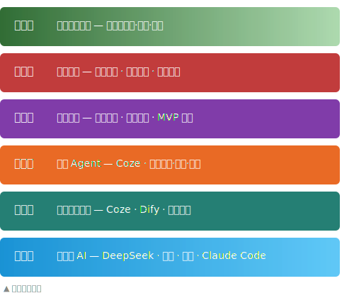

<div class="fig-caption">图：AI Agent 六层能力阶梯</div>

</div>
</div>

> 核心公式：AI Agent = 大脑(LLM) + 规划 + 记忆 + 工具使用。六层体系，从工具到伙伴。

---

<!-- _class: contentPage -->
<!-- _header: "1.1 初踏殿堂的体验——对话式AI" -->

<div class="slide-intro">

**对话式 AI** <span class="hl">是</span>基于大语言模型的自然语言交互工具，它<span class="hl">主要应用于</span>知识问答、文案创作和代码生成场景，<span class="hl">不同于</span>只能返回链接的**传统搜索引擎**，<span class="hl">它能</span>理解上下文、持续追问并结构化输出，<span class="hl">能解决</span>信息获取效率低和创意启动难的问题。

</div>

<div class="cols">
<div>

**核心产品**: DeepSeek · 豆包 · 千问 · ChatGPT

**本质**: 你问我答，单轮/多轮自然语言交互

- **适用场景**: 知识问答、文案撰写、代码生成、翻译润色、头脑风暴
- **核心技巧**:
  - **明确角色**: "你是一名资深产品经理..."
  - **提供上下文**: 背景 + 目标 + 约束条件
  - **迭代追问**: 不满意就补充信息继续问
  - **结构化输出**: "请用表格列出..."

</div>
<div>

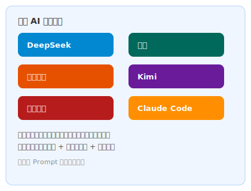

<div class="fig-caption">图：主流对话式 AI 产品生态</div>

</div>
</div>

> 对话式 AI 是起点，不是终点。写好提示词，是普通人驾驭 AI 的第一项核心技能。

---

<!-- _class: contentPage -->
<!-- _header: "1.2 让机器替你跑流程——自动化工作流" -->

<div class="slide-intro">

**自动化工作流**<span class="hl">是</span>将固定业务流程节点化的编排工具，它<span class="hl">主要应用于</span>重复性标准化任务的自动执行，<span class="hl">不同于</span>每次**手动操作的低效方式**，它一次配置即可永久自动运行，<span class="hl">能解决</span>重复劳动大量吞噬工作时间的问题。

</div>

<div class="cols">
<div>

**代表平台**: RPA · 快捷指令 · IFTTT

**本质**: 将固定流程节点化、自动化，执行规范化标准任务

**典型结构**: 触发器 → 输入解析 → 逻辑分支 → 工具调用 → 输出格式化

**常见场景**:
- 自动抓取新闻 → 摘要 → 生成日报
- 上传发票截图 → OCR 识别 → 提取字段 → 录入表格
- 定时监控竞品 → 对比分析 → 推送告警

</div>
<div>

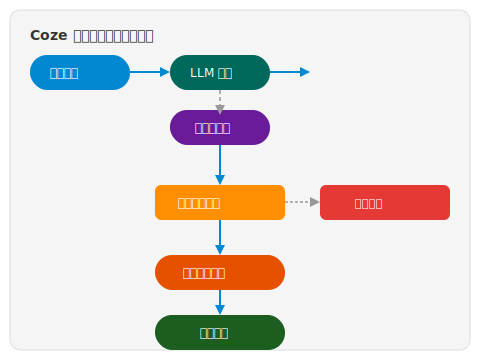

<div class="fig-caption">图：自动化工作流示意</div>

</div>
</div>

> 把每次都要做的事变成一键搞定。工作流不酷，但它是效率提升最实在的一步。

---

<!-- _class: contentPage -->
<!-- _header: "1.3 给AI装上自己的大脑——自主Agent" -->

<div class="slide-intro">

**自主 Agent** <span class="hl">是</span>具备独立规划与执行能力的 AI 智能体，它<span class="hl">主要应用于</span>需要多步骤动态决策的复杂任务，<span class="hl">不同于</span>**路径固定的工作流**，<span class="hl">它能</span>根据环境反馈自主调整策略、选择工具并形成闭环，<span class="hl">能解决</span>开放式任务中不可预见的路径变化问题。

</div>

<div class="cols">
<div>

**代表平台**: OpenClaw · Hermes Agent · Coze

**本质**: Agent 拥有自己的意识——能自主规划、主动交互、主动收集内容

- **核心能力**: 任务拆解 · 工具选择 · 反馈闭环
- **与工作流的区别**: 工作流路径固定，自主 Agent 路径动态

</div>
<div>

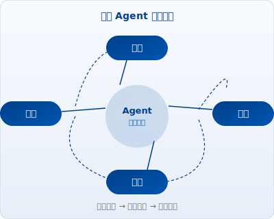

<div class="fig-caption">图：自主 Agent 规划-执行-观察-反思循环</div>

</div>
</div>

> "帮我做一个小红书竞品分析" → Agent 自动搜索素材、整理数据、生成报告。固定流程 vs 动态决策，这是 Agent 进化的关键一跃。

---

<!-- _class: contentPage -->
<!-- _header: "1.4 从想法到可用的产品——项目落地" -->

<div class="slide-intro">

**项目落地**<span class="hl">是</span> Agent 从对话工具进化为开发者的关键跃迁，它覆盖从需求理解到 MVP 交付的完整工程链路，<span class="hl">不同于</span>**仅停留在交互层面的对话式 AI**，<span class="hl">它能</span>设计架构、编写代码、部署应用，<span class="hl">能解决</span>从想法到可运行产品之间的工程鸿沟问题。

</div>

<div class="cols">
<div>

**代表平台**: Trae · Copilot · Qoder

**本质**: Agent 不仅能回答问题、执行任务，还能理解用户需求、开发定制化技术产品

- **能力跃迁**:
  - 理解用户真实需求（不仅是表面诉求）
  - 设计技术方案和系统架构
  - 编写代码、搭建数据库、部署应用
  - 交付可用的最小可行产品（MVP）

</div>
<div>

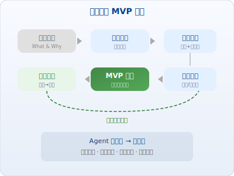

<div class="fig-caption">图：从需求到 MVP 交付全流程</div>

</div>
</div>

> 从"使用工具"到"创造工具"——Agent 不再是助手，而是你的开发团队。

---

<!-- _class: contentPage -->
<!-- _header: "1.5 打造完整的数字工厂——系统建设" -->

<div class="slide-intro">

**系统建设**<span class="hl">是</span>在单项目基础上叠加架构、安全、集成与运维能力的系统级解决方案，它<span class="hl">主要应用于</span>企业级多模块复杂场景，<span class="hl">不同于</span>**只能演示的独立 Demo**，它具备权限管控、系统集成和持续运维等生产级能力，<span class="hl">能解决</span>从能用到好用、从单点到体系的规模化问题。

</div>

<div class="cols">
<div>

**代表平台**: Trae Solo · WorkBuddy · 悟空

**本质**: 在第四层基础上，构建完整可用、可扩展、可维护的系统级解决方案

**新增能力**: 多模块设计 · 权限安全 · 系统集成 · 持续运维

**典型案例**:
- 企业内部报销审批全流程系统
- 多数据源汇聚 + 清洗 + 分析平台
- 智能客服 + 工单管理一体化平台

</div>
<div>

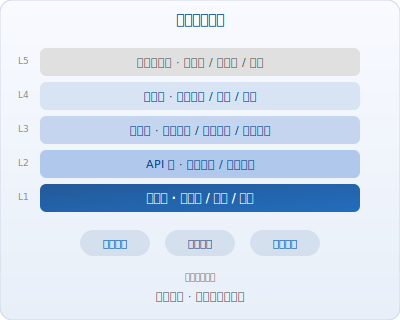

<div class="fig-caption">图：系统分层架构示意</div>

</div>
</div>

> 从能用到好用，从单点到体系——系统建设让 Agent 从 Demo 走向生产环境。

---

<!-- _class: contentPage -->
<!-- _header: "1.6 全天候在线的隐形管家——高阶生活助理" -->

<div class="slide-intro">

**高阶生活助理**<span class="hl">是</span> AI Agent 的理想终极形态——全天候在线的数字伴侣，它跨设备、跨平台主动感知用户需求，<span class="hl">不同于</span>**被动等待指令的普通助手**，它具备记忆偏好、预判需求和跨场景协同的能力，<span class="hl">能解决</span>信息过载时代个人精力有限、决策疲劳的问题。

</div>

<div class="cols">
<div>

**代表平台**: Claude Code · Codex

**理想形态**: 全天候在线，主动感知用户需求，跨设备、跨平台无缝协同，记忆用户偏好、习惯、历史决策，复杂问题自主规划，简单问题即时响应

</div>
<div>

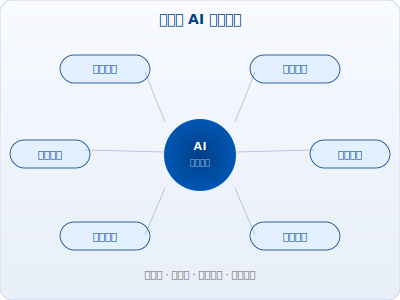

<div class="fig-caption">图：全场景 AI 生活助理能力矩阵</div>

</div>
</div>

> 从"你命令它做事"到"它懂你、帮你、替你"——这是 AI Agent 的终极愿景。

---

<!-- _class: contentPage -->
<!-- _header: "Part 1 小结" -->

<div class="slide-intro">

**六个层级，六种能力**，一条进化路径——从简单对话到全场景助理，每跨越一层，AI 的能力边界和你的使用方式都会发生质变。

</div>

| 层级 | 模式 | 代表 | 关键词 |
|:----:|------|------|--------|
| 1 | 对话问答 | DeepSeek / 豆包 / 千问 / ChatGPT | 提示词 |
| 2 | 自动化工作流 | RPA / 快捷指令 / IFTTT | 流程编排 |
| 3 | 自主智能体 | OpenClaw / Hermes Agent / Coze | 自主规划 |
| 4 | 项目落地 | Trae / Copilot / Qoder | MVP 交付 |
| 5 | 系统建设 | Trae Solo / WorkBuddy / 悟空 | 架构设计 |
| 6 | 效率助理 | Claude Code / Codex | 主动智能 |

> 不是工具变强了，是你的使用方式升级了。从第一层到第六层，每一步都是认知的跃迁。

---

<!-- _class: homePage part2bg -->
<!-- _header: "" -->
<!-- _footer: "" -->
<!-- _paginate: "" -->

# Part 2

## Coze 智能体实战指南

---

<!-- _class: contentPage -->
<!-- _header: "Part 2 总览" -->

<div class="slide-intro">

**Coze** <span class="hl">是</span>字节跳动推出的零代码 AI 智能体构建平台，它覆盖从创建到发布的完整六步工具链，<span class="hl">不同于</span>**需要编程背景的传统开发平台**，<span class="hl">它通过</span>可视化拖拽、插件市场和一键多渠道发布，<span class="hl">能解决</span>普通人想做 AI 应用但不懂代码的问题。

</div>

| 步骤 | 核心动作 | 关键词 |
|:----:|------|------|
| 1 | 平台初识 | 零代码 AI 乐高工厂 |
| 2 | 角色设计 | 给 AI 写灵魂简历 |
| 3 | 知识库构建 | 给 AI 装上私域大脑 |
| 4 | 工作流编排 | 搭积木一样搭流程 |
| 5 | 插件扩展 | 让 Agent 从会说到能干 |
| 6 | 发布与生态 | 一键发布 + Agent World |

> 人设 + 知识 + 工作流 + 插件 = 真正能干活的生产力智能体。六步闭环，从零到一。

---

<!-- _class: contentPage -->
<!-- _header: "2.1 零代码的AI乐高工厂——Coze平台初识" -->

<div class="slide-intro">

**Coze 平台**<span class="hl">是</span>普通人构建 AI 智能体的零代码工作台，它<span class="hl">主要应用于</span>聊天机器人、自动化流程和 AI 应用的快速搭建，<span class="hl">不同于</span>**需要编程能力的传统开发工具**，<span class="hl">它通过</span>可视化界面和丰富模板让不懂代码的人也能创建功能完整的 AI Bot，<span class="hl">能解决</span> AI 开发门槛过高的核心痛点。

</div>

<div class="cols">
<div>

**核心优势**:
- 无需编程，可视化操作
- 内置大模型能力（豆包等）
- 丰富的插件与工具生态
- 多渠道一键发布

**六大能力阶梯**: 创建智能体 → 知识库增强 → 工作流编排 → 插件工具 → 发布集成 → 商店生态

</div>
<div>


<div class="fig-caption">图：邀请注册链接</div>

</div>
</div>

> 扫码注册 Coze，欢迎加好友一起探索智能体 —— 我的 Coze 邮箱：syjsu@coze.email，注册后来打个招呼吧！

---

<!-- _class: contentPage -->
<!-- _header: "2.2 给AI写一份灵魂简历——角色设计" -->

<div class="slide-intro">

**角色设计**<span class="hl">是</span>用自然语言 Prompt 定义 Agent 人设与行为边界的方法，它<span class="hl">主要应用于</span>让 AI 回答精准匹配特定业务场景，<span class="hl">不同于</span>**写死规则的硬编码配置方式**，它只需用自然语言描述角色、目标和约束就能灵活调整 Agent 风格，<span class="hl">能解决</span>通用 AI 回答过于泛化、缺乏业务针对性的问题。

</div>

<div class="cols">
<div>

**选择模板 → 设定人设 → 配置能力 → 调试优化**

- **从模板开始**: Coze 提供丰富的预设模板（客服、助手、翻译等）
- **人设 Prompt**: 用自然语言定义 Agent 的角色、目标、行为边界
- **开场白**: 设定 AI 的第一步问候，引导用户交互
- **调试预览**: 右侧实时对话测试，边调边改

</div>
<div>

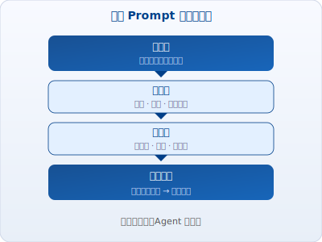

<div class="fig-caption">图：人设 Prompt 四步设计法</div>

</div>
</div>

> 人设越具体，Agent 的行为越精准。好 Prompt 不是写出来的，是调出来的。

---

<!-- _class: contentPage -->
<!-- _header: "2.3 给AI装上私域大脑——知识库与RAG" -->

<div class="slide-intro">

**知识库**<span class="hl">是</span> Agent 的私域信息存储与检索系统，它基于 RAG（检索增强生成）技术让 AI 回答基于企业自有文档，<span class="hl">不同于</span>**仅依赖训练数据的通用大模型**，<span class="hl">它能</span>引用具体出处、大幅减少幻觉，<span class="hl">能解决</span>通用 AI 不懂企业专属业务的根本问题。

</div>

<div class="cols">
<div>

**上传资料 → 自动分段 → 向量检索 → 精准回答**

- **支持格式**: PDF / Word / TXT / 网页链接 / 飞书文档 / 表格
- **核心价值**: 减少幻觉，回答有据可依

**场景示例**:
```
公司员工手册.pdf → 上传知识库
→ 员工提问 → Agent 检索
→ 生成回答引用出处
```

</div>
<div>

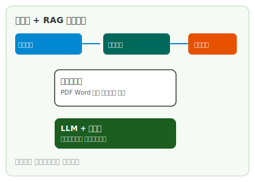

<div class="fig-caption">图：RAG 知识库检索增强流程</div>

</div>
</div>

> 没有知识库的 Agent 是通用脑，装了知识库的 Agent 是你的专属顾问。

---

<!-- _class: contentPage -->
<!-- _header: "2.4 像搭积木一样编排流程——工作流自动化" -->

<div class="slide-intro">

**工作流编排**<span class="hl">是</span> Coze 的核心自动化引擎，它<span class="hl">主要应用于</span>将复杂业务流程拆解为可拖拽编排的节点链路，<span class="hl">不同于</span>需要**写代码实现业务逻辑的传统方式**，它用可视化节点连接就能完成从输入、处理到输出的全链路自动化，<span class="hl">能解决</span>非技术人员无法独立实现业务流程自动化的问题。

</div>

<div class="cols">
<div>

**拖拽节点 → 配置逻辑 → 连接工具 → 一键运行**

| 节点 | 功能 |
|------|------|
| 开始 / 结束 | 接收输入 → 返回结果 |
| 大模型 / 知识库 | LLM 处理文本 + 检索私有文档 |
| 代码 / 条件分支 | 运行脚本 + 逻辑分流 |
| 插件 | 调用外部工具与 API |

**案例**: 输入主题 → 搜索热点 → 检索素材 → 生成文案 → 输出草稿

</div>
<div>


<div class="fig-caption">图：Coze 工作流节点编排示意</div>

</div>
</div>

> 工作流是 Coze 的核心竞争力——不会写代码没关系，会画流程图就能搭建自动化流程。

---

<!-- _class: contentPage -->
<!-- _header: "2.5 给AI装上万能工具箱——插件能力扩展" -->

<div class="slide-intro">

**插件**<span class="hl">是</span> Agent 连接外部世界的功能扩展模块，它覆盖搜索、图像、数据、代码、办公和资讯六大领域，<span class="hl">不同于</span> **Agent 内置的纯对话能力**，它赋予 Agent 实际执行搜索、绘图、计算和发送消息等动作的能力，<span class="hl">能解决</span> AI 只会说不会做的核心瓶颈问题。

</div>

<div class="cols">
<div>

| 分类 | 插件示例 |
|------|----------|
| 搜索 | 必应搜索、网页解析 |
| 图像 | 图片理解、AI 绘图 |
| 数据 | 数据分析、图表生成 |
| 代码 | Python / JavaScript 执行 |
| 办公 | 飞书文档、表格、日历 |
| 资讯 | 新闻、天气、股票查询 |

</div>
<div>

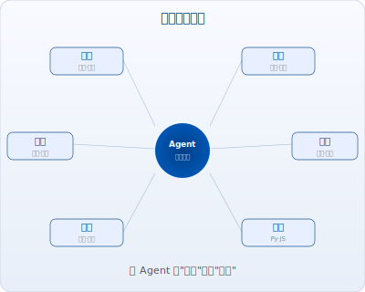

<div class="fig-caption">图：插件生态矩阵</div>

</div>
</div>

> 插件是 Agent 的"手"——有了手，它才能查数据、算结果、画图表、发消息。

---

<!-- _class: contentPage -->
<!-- _header: "2.6 让你的Agent无处不在——多渠道发布" -->

<div class="slide-intro">

**多渠道发布**<span class="hl">是</span> Coze 的一键分发能力，<span class="hl">它能</span>将同一个 Agent 同时部署到飞书、微信、网页和 API 接口，<span class="hl">不同于</span>**每个渠道需要单独开发对接的传统方式**，它一次搭建即可全渠道触达用户，<span class="hl">能解决</span> Agent 做好了却找不到用户的最后一公里问题。

</div>

<div class="cols">
<div>

- **飞书**: 直接在飞书群里当机器人用
- **微信公众号**: 接入客服消息
- **API**: 通过 HTTP 接口集成到自己的系统
- **Web**: 嵌入网页，生成分享链接

</div>
<div>

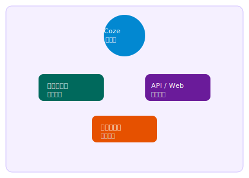

<div class="fig-caption">图：Coze 多渠道发布矩阵</div>

</div>
</div>

> 搭建一次，发布全渠道。你的 Agent 不应该困在开发平台里。

---

<!-- _class: contentPage -->
<!-- _header: "2.7 像逛应用商店一样找AI——Agent World" -->

<div class="slide-intro">

**Agent World** <span class="hl">是</span> Skill Hub 的进阶形态——AI 智能体的发现与协作平台，它类似于手机应用商店但面向 AI Agent，<span class="hl">不同于</span>**一切从零开始创建的传统方式**，它可以一键复制他人优质智能体并二次改造、也可以分享自己的作品，<span class="hl">能解决</span>不知道做什么和不知道怎么做的冷启动问题。

</div>

<div class="cols">
<div>

**Agent World（智能体世界）**: Skill Hub 的进阶版，发现他人创作的优质智能体，一键复制使用，支持二次改造

**社区生态**: 分享自己的智能体，学习他人的 Prompt 和工作流设计，协作共创复杂项目

</div>
<div>

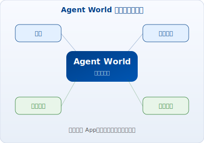

<div class="fig-caption">图：Agent World 智能体世界生态</div>

</div>
</div>

> 未来 AI 能力的分发方式——不是下载 App，而是发现和订阅智能体。

---

<!-- _class: contentPage -->
<!-- _header: "Part 2 小结" -->

<div class="slide-intro">

从人设 Prompt 到多渠道发布，**六步闭环**构成 Coze 智能体构建的完整方法论——每一步都<span class="hl">是</span>零代码，每一步都在降低 AI 创建的门槛。

</div>

| 步骤 | 能力 | 一句话 |
|:----:|------|--------|
| 1 | 创建智能体 · 角色设计 | 用 Prompt 定义 Agent 的灵魂 |
| 2 | 知识库构建 · RAG 增强 | 给 Agent 装上私域大脑 |
| 3 | 工作流编排 · 自动化 | 拖拽搭建自动化流程 |
| 4 | 插件工具集 · 能力扩展 | 让 Agent 从会说变成能干 |
| 5 | 多渠道发布 · 触达用户 | 一键发布到飞书/微信/网页 |
| 6 | Agent World · 智能体世界 | 发现和分享智能体 |

> Coze 的核心逻辑：人设 + 知识 + 工作流 + 插件 = 真正能干活的生产力智能体。

---

<!-- _class: homePage part3bg -->
<!-- _header: "" -->
<!-- _footer: "" -->
<!-- _paginate: "" -->

# Part 3

## 需求挖掘与小班课预告

---

<!-- _class: contentPage -->
<!-- _header: "Part 3 总览" -->

<div class="slide-intro">

**从需求到交付的实战链路**<span class="hl">是</span>连接 AI 能力与业务落地的五步方法论，它覆盖 STAR 梳理、案例拆解、深度挖掘、极速 MVP 和小班课实战，<span class="hl">不同于</span>**纯理论的 AI 课程**，它拿真实需求直接开练，<span class="hl">能解决</span>学了 AI 但不会在实际工作中让 Agent 真正跑起来的问题。

</div>

| 环节 | 核心方法 | 关键词 |
|:----:|------|------|
| 1 | STAR 需求梳理 | Situation → Task → Action → Result |
| 2 | 真实案例拆解 | 发票报销全流程 |
| 3 | 深层次需求挖掘 | 冰山模型 · 追问五法 |
| 4 | Agent 极速 MVP | 传统 2 周 → Agent 1 天 |
| 5 | 小班课实战 | 从观众到主角 |

> 80% 的需求失败不是因为做不了，而是因为需求本身没梳理清楚。

---

<!-- _class: contentPage -->
<!-- _header: "Part 3 STAR 法则梳理需求" -->

<div class="slide-intro">

**STAR 法则**<span class="hl">是</span>将模糊需求拆解为情境、任务、行动、结果四个维度的结构化分析框架，它<span class="hl">主要应用于</span>需求不清晰的项目启动阶段，<span class="hl">不同于</span>**凭感觉直接动手的做事方式**，它用四个维度把需求变成可量化、可验证、可交付的方案，<span class="hl">能解决</span>需求沟通中理解偏差和范围无限蔓延的核心问题。

</div>

<div class="cols">
<div>

| 要素 | 含义 | 对应 |
|:----:|------|------|
| **S**ituation | 情境 | 业务背景、现状痛点、核心问题 |
| **T**ask | 任务 | 需求目标、衡量标准、交付范围 |
| **A**ction | 行动 | 解决方案、功能设计、实施路径 |
| **R**esult | 结果 | 预期收益、指标达成、迭代方向 |

</div>
<div>

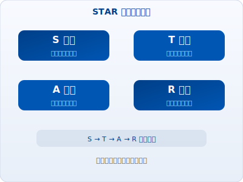

<div class="fig-caption">图：STAR 需求梳理框架</div>

</div>
</div>

> STAR 不只是一个框架，它是一种思维方式——先搞清楚问题，再动手解决。

---

<!-- _class: contentPage -->
<!-- _header: "3.1 一百张发票的烦恼——真实需求案例" -->

<div class="slide-intro">

**发票报销场景**<span class="hl">是</span>检验 Agent 实战能力的典型需求样本，它涉及多源异构数据、OCR 识别、格式清洗、规则校验和报表输出，<span class="hl">不同于</span>**简单的单步骤任务**，它需要 Agent 串联多个处理环节形成完整链路，能完整展示 Agent 从数据处理到决策支持的全栈能力。

</div>

<div class="cols">
<div>

> 团队每月经手上百张报销发票，来自不同采购渠道：
> - 电商平台截图（京东、淘宝）
> - 正规电子发票（PDF/OFD）
> - 纸质发票（手机拍照）
> - 零星收据/小票（照片）

</div>
<div>

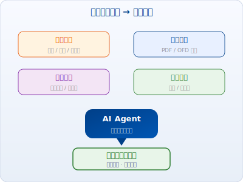

<div class="fig-caption">图：异构发票来源 → 统一处理</div>

</div>
</div>

> 这个场景看似"只是发票整理"，但深入挖掘之后，你会发现一个完整的财务数据中台需求。

---

<!-- _class: contentPage -->
<!-- _header: "3.2 杂货铺变身标准化仓库——异构数据清洗" -->

<div class="slide-intro">

**异构数据清洗**<span class="hl">是</span>将多源杂乱数据转化为统一标准格式的自动化处理过程，它<span class="hl">主要应用于</span>发票、单据等多渠道异构文件的集中处理场景，<span class="hl">不同于</span>**人工逐份下载、识别、录入的传统方式**，<span class="hl">它通过</span> Agent 串联下载、OCR、清洗、填表和异常标记五个环节，<span class="hl">能解决</span>多源异构数据手工整理耗时易错的根本问题。

</div>

<div class="cols">
<div>

**Agent 能做什么**:
1. 自动下载各渠道文件
2. OCR 识别提取关键字段
3. 格式转换与数据清洗
4. 填入预设模板
5. 标记异常待人工校验

</div>
<div>

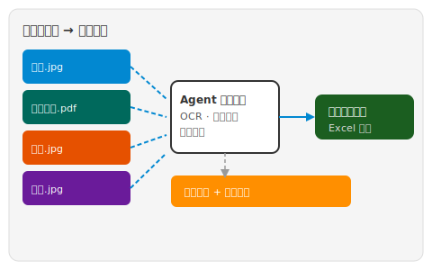

<div class="fig-caption">图：发票处理自动化全流程</div>

</div>
</div>

> 异构数据源 → 统一标准化模板。这是 Agent 最擅长的脏活累活。

---

<!-- _class: contentPage -->
<!-- _header: "3.3 从人工核对到一键出表——审核与报表" -->

<div class="slide-intro">

**审核与报表**<span class="hl">是</span>将原始数据转化为可决策管理信息的关键闭环，它覆盖规则校验、异常标记、人工复核到最终报表的完整链路，<span class="hl">不同于</span>**人工逐条核对的低效方式**，<span class="hl">它通过</span>自动校验加分层的异常处理机制，<span class="hl">能解决</span>报销审核从体力活到确认一下的效率革命问题。

</div>

<div class="cols">
<div>

**处理流程**: 原始数据 → 规则校验 → 异常标记 → 人工复核 → 最终报表

**报表呈现**:
- 按月份汇总：月度报销趋势图
- 按类目汇总：各部门/各品类占比
- 异常统计：问题发票分类 + 处理状态

</div>
<div>

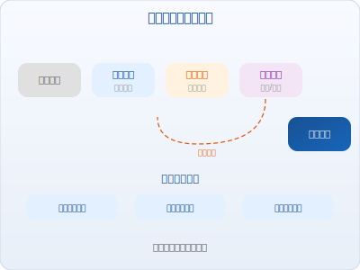

<div class="fig-caption">图：审核与报表处理流程</div>

</div>
</div>

> 从人工核对到一键出表，Agent 把报销审核从"体力活"变成了"确认一下"。

---

<!-- _class: contentPage -->
<!-- _header: "3.4 冰山下的真相——深层次需求挖掘" -->

<div class="slide-intro">

**深层次需求挖掘**<span class="hl">是</span>通过连续追问穿透表面诉求的分析方法，它基于冰山模型——水面之上是表面需求、水面之下才是真实需求，<span class="hl">不同于</span>**用户说什么就做什么的被动响应模式**，<span class="hl">它通过</span>五个追问层层深入，<span class="hl">能解决</span>做了一个功能却发现根本不是用户真正需要的伪需求问题。

</div>

<div class="cols">
<div>

| 追问 | 发现的新需求 |
|------|-------------|
| "这些数据整理好后要导入哪里？" | → 需要与财务系统对接的接口 |
| "报账周期是多久一次？" | → 需要月度自动汇总 + 周期提醒 |
| "除了个人报销，还有部门预算吗？" | → 需要部门级预算看板 |
| "老板要看什么维度的数据？" | → 需要管理层驾驶舱 |
| "这些数据和税务申报有关吗？" | → 需要合规性预检 |

</div>
<div>

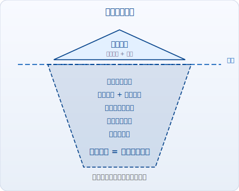

<div class="fig-caption">图：需求冰山模型</div>

</div>
</div>

> 表面需求 = 发票整理 + 报表。真实需求 = 财务数据中台 + 预算管理 + 合规风控 + 决策支持。

---

<!-- _class: contentPage -->
<!-- _header: "3.5 两周变一天的魔法——Agent极速MVP" -->

<div class="slide-intro">

**Agent 极速 MVP** <span class="hl">是</span>利用 AI 自主规划能力快速搭建可运行原型的方法，它<span class="hl">主要应用于</span>需求验证和快速试错阶段，<span class="hl">不同于</span>**传统开发的需求文档→排期→开发→测试的长周期流程**，<span class="hl">它能</span>在一天内给出可交互的 Demo 并持续迭代，<span class="hl">能解决</span>传统开发周期太长导致验证成本过高的核心问题。

</div>

<div class="cols">
<div>

**传统开发流程**: 需求沟通 → 写文档 → 排期 → 开发（2周） → 测试 → 上线

**Agent 辅助流程**: 需求沟通 → Agent 自主规划 → 快速搭建 MVP（1天） → 用户试用 → 迭代

</div>
<div>

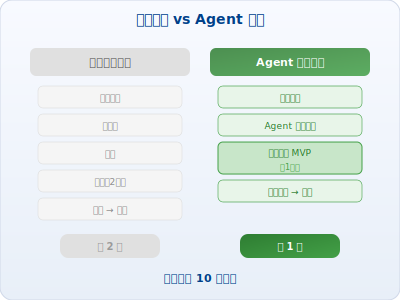

<div class="fig-caption">图：传统开发 vs Agent 辅助对比</div>

</div>
</div>

> 传统 2 周 → Agent 1 天，效率提升 10 倍以上。不是替代开发者，而是让验证成本趋近于零。

---

<!-- _class: contentPage -->
<!-- _header: "3.6 从观众到主角的蜕变——小班课预告" -->

<div class="slide-intro">

**小班课**<span class="hl">是</span>从观众到创建者的实战转型项目，它覆盖需求调研、STAR 梳理、方案设计、Agent 搭建到交付验收的全链路，<span class="hl">不同于</span>**纯理论的线上课程**，它用真实项目驱动加精细化指导确保成果交付，<span class="hl">能解决</span>学完还是不会用、做了跑不通的落地最后一公里问题。

</div>

<div class="cols">
<div>

**从需求洞察到交付落地的全流程实战**

- **实战驱动**: 不教理论，直接拿真实需求开练
- **全链路覆盖**: 需求调研 → STAR 梳理 → 方案设计 → Agent 搭建 → 交付验收
- **小班教学**: 每期限额，精细化项目制指导
- **成果交付**: 课程结束时，你手上有一个真正跑起来的系统

**适合人群**:
- 想用 AI 提升工作效率的职场人
- 想转型 AI 产品经理/解决方案的从业者
- 对 Agent 开发感兴趣的技术爱好者

</div>
<div>

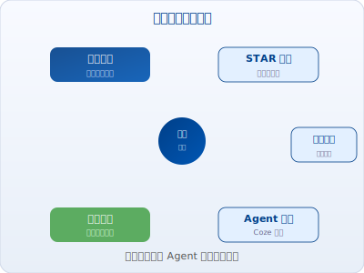

<div class="fig-caption">图：小班课全链路实战</div>

</div>
</div>

> 不做 AI 时代的旁观者。一堂课，从观众变主角。

---

<!-- _class: contentPage -->
<!-- _header: "Part 3 小结" -->

<div class="slide-intro">

从 STAR 需求梳理到小班课交付验收，**五步闭环**构成 Agent 项目落地的完整实战路径——每一步都在解决真实问题，每一步都在产出可交付的成果。

</div>

| 环节 | 要点 | 一句话 |
|:----:|------|--------|
| 1 | STAR 梳理 | 先搞清楚问题，再动手解决 |
| 2 | 案例实战 | 从发票场景看 Agent 全链路能力 |
| 3 | 需求挖掘 | 表面需求之下藏着更大的系统 |
| 4 | Agent MVP | 两周变一天，不是口号是事实 |
| 5 | 小班课 | 不做观众，做 Agent 时代的创建者 |

> 不是工具变强了，是你的使用方式升级了。从对话到交付，你已经掌握了 AI Agent 的全栈能力。

---

<!-- _class: homePage -->
<!-- _header: "" -->
<!-- _footer: "" -->
<!-- _paginate: "" -->

# 谢谢！欢迎关注

## 公众号/小红书/抖音/视频号

**@天街小雨润如苏同学**
